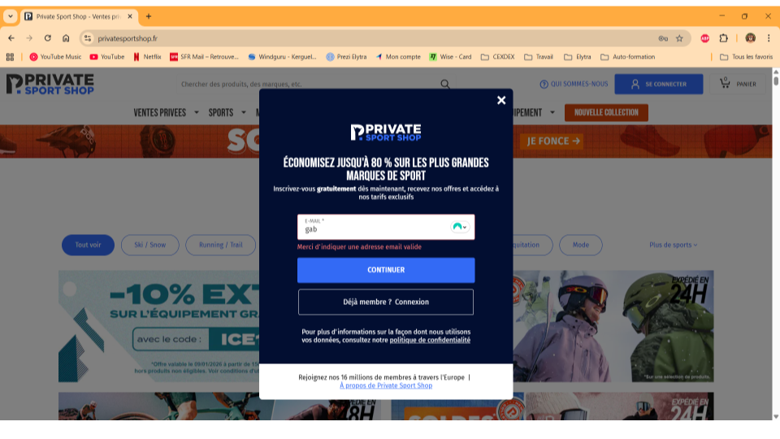

## Save button enabled with incomplete required sign-up fields

# Type
bug

# Severity 
Medium

# Priority 
High 

# Environment 
Environment : Website 
Browser : Chrome Version 143.0.7499.193
OS : Windows 11 Pro
Device : Desktop 

# Description
While creating an account on the website with the option "sign-in", the "save" button turn green with only the name give, while all other necessary informations were not given.

# Steps to reproduce
1 : Go to https://www.privatesportshop.fr/
2 : Select "sign-in" (top-right corner)
3 : Fill only the name field
4 : Leave all the other required fields empty

# Expected result 
The "save" button should stay grey, until all necessary informations are given. 

# Actual result 
Only entering a name is enought to turn green the "save" button

# Reproducability 
Always 5 / 5

# Impact 
- User frustration
- User misunderstanding
- Unwanted support request 
- Lack of user signed-in 

# Attachments 
Screenshot showing the "Save" button enabled while required fields are empty

# Note / Additional information

# Regression risk : 
- Other forms using the same validation logic (login, profil update) 
- Front-end form validation framework

